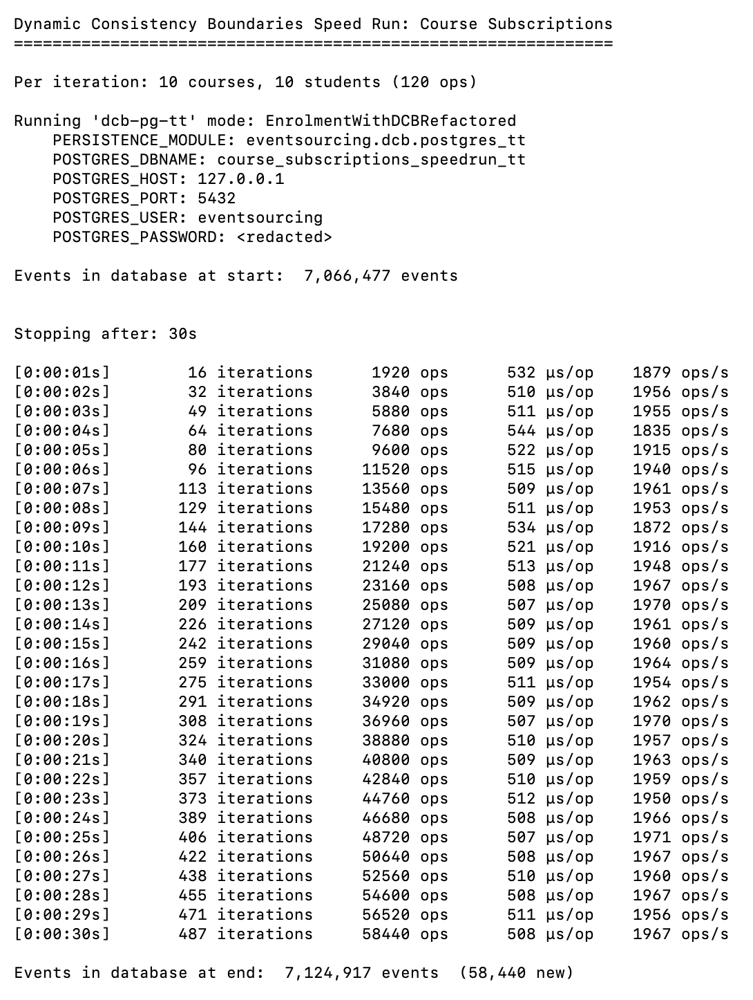

.. _DCB example 3:

DCB 3 - Enrolment - refactored
==============================

This example shows the same "course booking" example as the :doc:`previous example </topics/examples/coursebooking-dcb>`,
using a refactored style for `dynamic consistency boundaries <https://dcb.events/>`_, rather than
standard style suggested by the `specification <https://dcb.events/specification/>`_.

Model-specific domain event classes,
:class:`~examples.coursebookingdcbrefactored.application.StudentRegistered`,
:class:`~examples.coursebookingdcbrefactored.application.CourseRegistered`,
:class:`~examples.coursebookingdcbrefactored.application.StudentJoinedCourse`.
are defined to help with type checking and code navigation. They are used instead of
the :class:`~examples.dcb.api.DCBEvent` class in the application code.

The base domain event class :class:`~examples.coursebookingdcbrefactored.eventstore.DomainEvent` is defined using
the Python :data:`msgspec` package which defines dataclasses from type annotations, and is currently the fastest available
Python serialisation library giving the smallest packed sizes for the bytes of serialised data in
:class:`~examples.dcb.api.DCBEvent` objects.

A :class:`~examples.coursebookingdcbrefactored.eventstore.Mapper` is used when writing events to convert subclass instances of
:class:`~examples.coursebookingdcbrefactored.eventstore.DomainEvent` to the :class:`~examples.dcb.api.DCBEvent`
class, and to convert back from instances of :class:`~examples.dcb.api.DCBSequencedEvent` to the
domain event classes when reading events. This also encapsulates the serialisation and deserialisation of event data
that was visible in the previous example.

The :class:`~examples.coursebookingdcbrefactored.eventstore.Selector` class is used instead of the :class:`~examples.dcb.api.DCBQuery`
and :class:`~examples.dcb.api.DCBQueryItem` classes to define the consistency boundary for the command method, and in the
query methods. The :class:`~examples.coursebookingdcbrefactored.eventstore.Selector` class uses the domain event classes to indicate
selected types rather than strings. Instances, and sequences of instances, of :class:`~examples.coursebookingdcbrefactored.eventstore.Selector`
are converted to :class:`~examples.dcb.api.DCBQuery` objects by the :class:`~examples.coursebookingdcbrefactored.eventstore.EventStore` class.

The abstract :class:`~examples.dcb.api.DCBEventStore` interface is encapsulated by the
:class:`~examples.coursebookingdcbrefactored.eventstore.EventStore` class, which uses the
same concrete :class:`~examples.dcb.popo.InMemoryDCBEventStore` and
:class:`~examples.dcb.postgres.PostgresDCBEventStoreTS` classes introduced in the previous example.
The :func:`~examples.coursebookingdcbrefactored.eventstore.EventStore.put`
and :func:`~examples.coursebookingdcbrefactored.eventstore.EventStore.get` methods of the
:class:`~examples.coursebookingdcbrefactored.eventstore.EventStore` class support passing either a single instance
of :class:`~examples.coursebookingdcbrefactored.eventstore.Selector` or a sequence, which simplifies code statements.

The :func:`EventStore.get() <examples.coursebookingdcbrefactored.eventstore.EventStore.get>` method is overloaded with
three method signatures. It returns only domain events by default. But has optional arguments to request the
return of events each with their sequenced position. And alternatively, to return a sequence of events with
along with a single position indicating the last known position. This last option is most useful in a command
method for subsequently appending new events with selectors and the last known position, to ensure consistency
of the recorded data according the the technique for dynamic consistency boundaries. In this example at least,
only the command method actually needs the sequenced positions, and it only needs the last position of the events
in its consistency boundary. The query methods in this example do not need to receive the sequenced positions of
the recorded events, and so call :func:`~examples.coursebookingdcbrefactored.eventstore.EventStore.get()` with its default of only
returning domain events.

These refactorings improve the readability and integrity of the code, with a visual appearance that is similar
to the declarative syntax used by the event-sourced aggregates in the first example. This style dramatically
reduces the source lines of code, leaving room for the addition of more methods. :-)

Application
-----------

.. literalinclude:: ../../../examples/coursebookingdcbrefactored/application.py
    :pyobject: EnrolmentWithDCBRefactored

Domain model
------------

.. literalinclude:: ../../../examples/coursebookingdcbrefactored/application.py
    :pyobject: StudentJoinedCourse

.. literalinclude:: ../../../examples/coursebookingdcbrefactored/application.py
    :pyobject: StudentLeftCourse

.. literalinclude:: ../../../examples/coursebookingdcbrefactored/application.py
    :pyobject: Student

.. literalinclude:: ../../../examples/coursebookingdcbrefactored/application.py
    :pyobject: Course

.. literalinclude:: ../../../examples/coursebookingdcbrefactored/application.py
    :pyobject: StudentAndCourse

Supporting abstractions
-----------------------

.. literalinclude:: ../../../examples/coursebookingdcbrefactored/application.py
    :pyobject: Decision

.. literalinclude:: ../../../examples/coursebookingdcbrefactored/application.py
    :pyobject: InitialDecision

.. literalinclude:: ../../../examples/coursebookingdcbrefactored/application.py
    :pyobject: MsgspecStructMapper

.. literalinclude:: ../../../eventsourcing/dcb/domain.py
    :pyobject: CanInitialiseEnduringObject

.. literalinclude:: ../../../eventsourcing/dcb/domain.py
    :pyobject: CanMutateEnduringObject

.. literalinclude:: ../../../eventsourcing/dcb/persistence.py
    :pyobject: DCBMapper

.. literalinclude:: ../../../eventsourcing/dcb/persistence.py
    :pyobject: DCBEventStore

.. literalinclude:: ../../../eventsourcing/dcb/persistence.py
    :pyobject: DCBRepository

.. literalinclude:: ../../../eventsourcing/dcb/domain.py
    :pyobject: EnduringObject

.. literalinclude:: ../../../eventsourcing/dcb/domain.py
    :pyobject: Group

Test case
---------

The test case is the same as the :doc:`first example </topics/examples/coursebooking>`, but executed
with the :class:`~examples.coursebookingdcbrefactored.application.EnrolmentWithDCBRefactored` class above.

.. literalinclude:: ../../../examples/coursebookingdcbrefactored/test_application.py
    :pyobject: TestEnrolmentWithDCBRefactored

It also has some extra steps to cover the extra methods that were added to make further use of the more
declarative syntax for DCB.

Postgres DCB recorder v3
------------------------

A third attempt to implement implements the complex DCB query logic in Postgres is shown below. The
first attempt used array columns and array operator. It didn't work very well. The
:class:`~eventsourcing.dcb.postgres_ts.PostgresDCBRecorderTT` class shown below implements
the DCB event store interface using a secondary table of tags that is indexed with a B-tree.
The design of this implementation was focussed on selecting by tags first, which will typically
have high cardinality, and selecting by types and sequence position later in the query.
A multi-clause CTE statement is used to select events, passing the DCB query items as an composite
type array. A similar approach was tried for conditionally inserting event records, but this proved
to be suboptimal, and instead a stored procedure was developed that separates the "fail condition"
query from the conditional insertion of new events. This allows each part to be planned separately,
achieving much better performance. The index of sequence positions on the main table covers the
event types, which allows the results of selecting from the table of tags to be efficiently joined
with the main table and for events to filtered by type using only the indexes. The speedrun performance
report below shows how much better this third approach is than the version using ``tsvector`` with a GIN
index.

.. literalinclude:: ../../../eventsourcing/dcb/postgres_tt.py

Speed run
---------

The screen shot included here shows the performance of this implementation. The performance is many times
faster than the previous example, even with 7 million stored events. It run at around 70% of the speed of the
event-sourced aggregates in the first example.

One thing to notice about this report is that the number of new events recorded is the same as the number of
operations, whereas with the event-sourced aggregates implementation there were many more due to there being
two events recorded for each time a student joins a course (one for the student aggregate and one for the
course aggregate).

Because the refactored code above seems very usable, and the performance of the database implementation is
very good, it was decided to include support for DCB in this library in the :mod:`eventsourcing.dcb` package.
If you are feeling playful, have fun experimenting with dynamic consistency boundaries in Python!

Code reference
--------------

.. automodule:: eventsourcing.dcb.persistence
    :show-inheritance:
    :member-order: bysource
    :members:
    :undoc-members:
    :special-members: __init__

.. automodule:: eventsourcing.dcb.domain
    :show-inheritance:
    :member-order: bysource
    :members:
    :undoc-members:
    :special-members: __init__

.. automodule:: examples.coursebookingdcbrefactored.application
    :show-inheritance:
    :member-order: bysource
    :members:
    :undoc-members:
    :special-members: __init__

