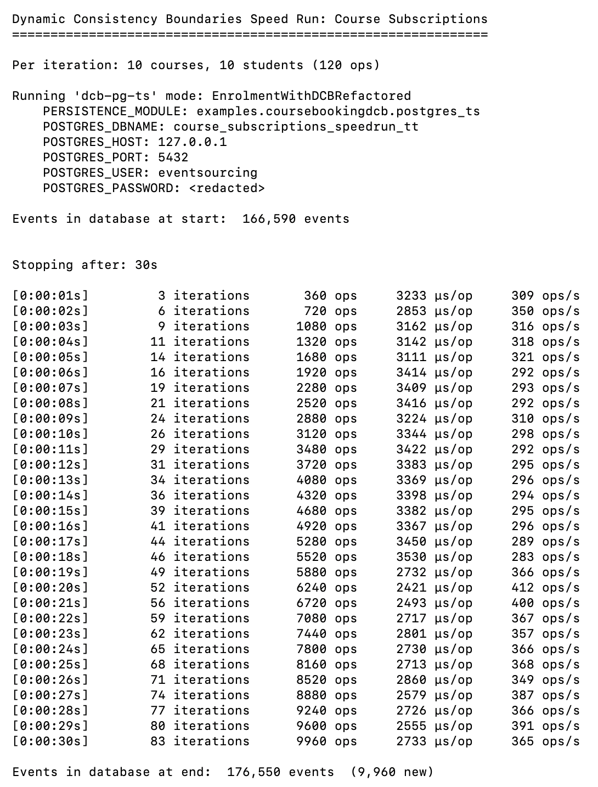

.. _DCB example 2:

DCB 2 - Coding the specification
================================

This example introduces the `specification <https://dcb.events/specification/>`_ of "dyanamic
consistency boundaries" and shows how to implement the "course subscriptions" challenge in Python
using the basic objects and methods of DCB. Whilst the code in this example is relatively verbose,
the DCB approach can be understood directly without any extra abstractions. The
:doc:`next example </topics/examples/coursebooking-dcb-refactored>` presents a refactored and
hopefully more refined style for DCB that is perhaps more usable.

Enrolment with DCB
------------------

The :class:`~examples.coursebookingdcb.application.EnrolmentWithDCB` class implements the
:class:`~examples.coursebooking.interface.EnrolmentInterface` interface, with its methods for registering
students and courses, for students joining courses, and for listing students for a course and
the courses for a student.

The application class :class:`~eventsourcing.dcb.application.DCBApplication` is a convenience introduced
to select and construct a concrete DCB event store implementation, according to its environment variable
configuration, just like the library's original :ref:`application class <Application objects>` does for
event-sourced aggregate recorders. This means we can easily run the application with an in-memory
persistence, and with PostgreSQL.

.. literalinclude:: ../../../examples/coursebookingdcb/application.py
    :pyobject: EnrolmentWithDCB

The test case is the same enrolment test case used in the :doc:`previous example </topics/examples/coursebooking>`,
but this time executed with the :class:`~examples.coursebookingdcb.application.EnrolmentWithDCB` class above rather than
:class:`~examples.coursebooking.application.EnrolmentWithAggregates`. The test method is run twice, once with an
in-memory implementation of the DCB event store, and again using PostgreSQL.

.. literalinclude:: ../../../examples/coursebookingdcb/test_application.py
    :pyobject: TestEnrolmentWithDCB

DCB API
-------

The application methods are implemented using the DCB objects and methods
defined in the specification and explained in the :doc:`previous example </topics/examples/coursebooking>`.
The DCB classes used in this example are :class:`~eventsourcing.dcb.api.DCBEvent`,
:class:`~eventsourcing.dcb.api.DCBQuery`, :class:`~eventsourcing.dcb.api.DCBQueryItem`,
:class:`~eventsourcing.dcb.api.DCBAppendCondition` and :class:`~eventsourcing.dcb.api.DCBSequencedEvent`.

.. literalinclude:: ../../../eventsourcing/dcb/api.py
    :pyobject: DCBEvent

.. literalinclude:: ../../../eventsourcing/dcb/api.py
    :pyobject: DCBQuery

.. literalinclude:: ../../../eventsourcing/dcb/api.py
    :pyobject: DCBQueryItem

.. literalinclude:: ../../../eventsourcing/dcb/api.py
    :pyobject: DCBAppendCondition

.. literalinclude:: ../../../eventsourcing/dcb/api.py
    :pyobject: DCBSequencedEvent

The :class:`~eventsourcing.dcb.api.DCBRecorder` class defines an interface that has methods described in the DCB
specification for reading and appending DCB events. There is one enhancement, which is to return an :class:`int`
from the :func:`~eventsourcing.dcb.api.DCBRecorder.append` method. This supports returning the position of last appended
event, so that user interfaces for systems implemented with CQRS, that have eventually consistent "read" models,
can transition from a "write" view to a "read" view and wait for new events to be processed, avoiding the stale
read model problem.

.. literalinclude:: ../../../eventsourcing/dcb/api.py
    :pyobject: DCBRecorder

In-memory DCB recorder
----------------------

The :class:`~eventsourcing.dcb.popo.InMemoryDCBRecorder` class implements the DCB event store interface
using only Python objects. You can see the query logic for selecting events implemented with nested
generator expressions, and the append condition logic that is implemented in the append method. DCB
events are stored in memory, and "deep copied" when appending and when reading to avoid any corruption
of sequenced events.

.. literalinclude:: ../../../eventsourcing/dcb/popo.py
    :pyobject: InMemoryDCBRecorder

Postgres DCB recorder v2
------------------------

A second attempt to implement implements the complex DCB query logic in Postgres is shown below. The
first attempt used an array column for tags and array operators to search for types and tags. It didn't
work very well. The :class:`~examples.coursebookingdcb.postgres_ts.PostgresDCBRecorderTS` class shown
below implements the DCB event store interface using the Postgres ``tsvector`` and ``tsquery`` types,
and a GIN index.

The type and tags of a DCB event are prefixed and concatenated into a ``tsvector`` string. A set of DCB
query items is similarly compounded into a logical ``tsquery`` that expresses the DCB query logic. Database
functions for appending and selecting events are defined, and a custom composite type is defined for efficiently
sending an array of DCB events to the database.

In this way, both the read and the append operations of this DCB event store can be executed as fast as possible
with a single database round-trip.

.. literalinclude:: ../../../examples/coursebookingdcb/postgres_ts.py
    :pyobject: PostgresDCBRecorderTS

Speed run
---------

The screen shot included here shows the performance of this Postgres implementation, using the application from
the next example which uses a much faster JSON transcoder. Whilst the performance wasn't as terrible as the first
attempt using array columns and array operator (5 ops/s), it can only do around 10% of the speed of the event-sourced
aggregates application in the previous example, even with 10% of the volume of data in the database. The naive
implementation of the complex DCB query logic causes the performance to get worse and worse as the volume of recorded
events increases, decreasing to only a few ops/s when there are 5 million stored events.

Code reference
--------------

.. automodule:: eventsourcing.dcb.api
    :show-inheritance:
    :member-order: bysource
    :members:
    :undoc-members:
    :special-members: __init__

.. automodule:: eventsourcing.dcb.popo
    :show-inheritance:
    :member-order: bysource
    :members:
    :undoc-members:
    :special-members: __init__

.. automodule:: eventsourcing.dcb.application
    :show-inheritance:
    :member-order: bysource
    :members:
    :undoc-members:
    :special-members: __init__

.. automodule:: examples.coursebookingdcb.application
    :show-inheritance:
    :member-order: bysource
    :members:
    :undoc-members:
    :special-members: __init__

.. automodule:: examples.coursebookingdcb.postgres_ts
    :show-inheritance:
    :member-order: bysource
    :members:
    :undoc-members:
    :special-members: __init__
